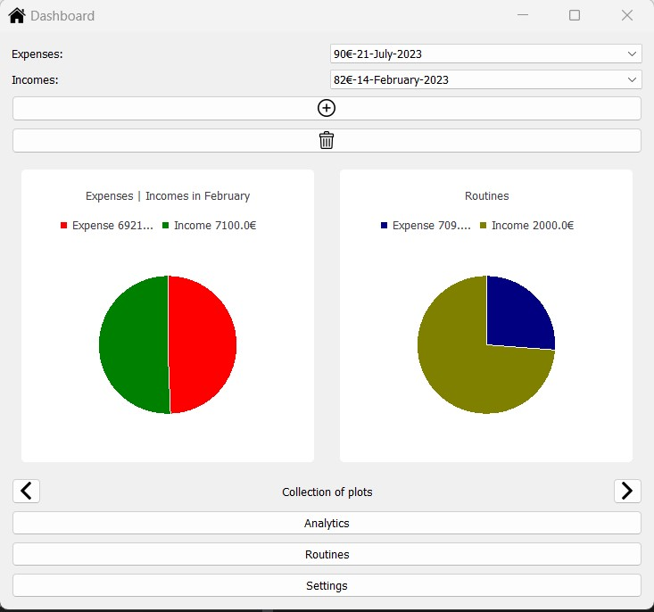
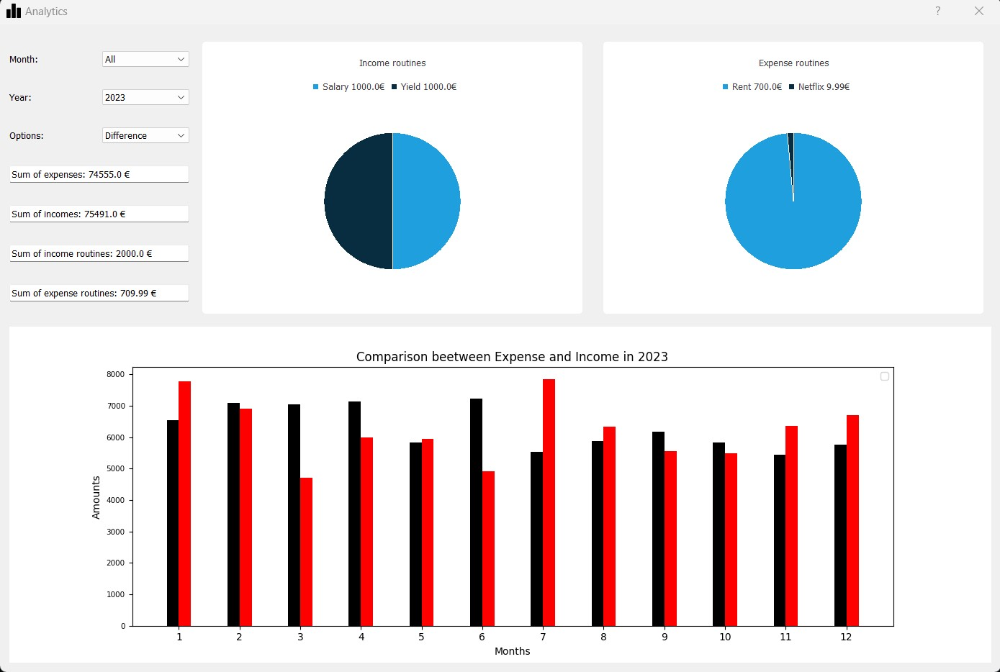

# :bar_chart: Expense_Tracker

Desktop application build with Python and PyQt5. Gives the possibility to keep track of your money. It includes analytics, routines and a currency converter. 

## :white_check_mark: Installation

```bash
git clone https://github.com/Jolumine/exp-trk.git
cd exp-trk
pip install bin/exptrk-3.1.1-py3-none-any.whl
python run.py
```

## :hammer_and_wrench: Usage

```txt
Read documentation for further informations. 
```

## 	:desktop_computer: UI

The data is just for development purpose and has been created with [file](dev/create_dev_data.py).
### Home screen (Dashboard)


### Analytics 



## :link:Contact

:iphone: Twitter: [Leo_Becker09](https://twitter.com/Leo_Becker09) <br>
:e-mail: Mail: thepythoncoder01@gmail.com
